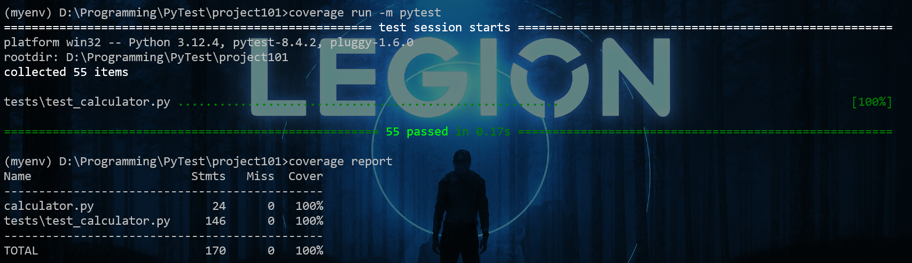
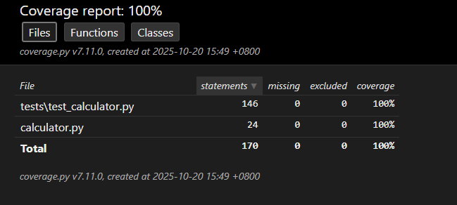
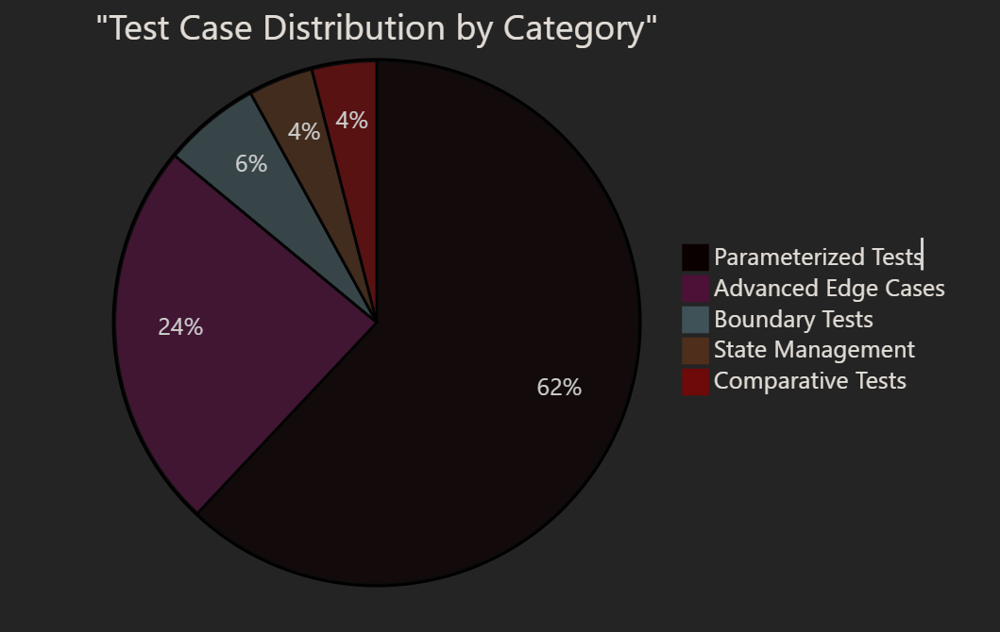

---
# 🧪 **Software Testing Report**


## **1\. Project Overview**

**Project Name:**  Py_Test_Calculator

**Repository URL:** [Py_Test_Calculator](https://github.com/Tanvir-yzu/Py_Test_Project_101.git)

**Live view :**  [Py_Test_Calculator](https://tanvir-yzu.github.io/Py_Test_Project_101/htmlcov/index.html)


**Description:**

> This project implements basic arithmetic and comparison functions (addition, subtraction, multiplication, division, maximum, and minimum).
> The goal is to verify that all functions behave correctly and handle exceptional or boundary input values properly.

Additional details:

- Features
  - Arithmetic: `add(a, b)`, `subtract(a, b)`, `multiply(a, b)`, `divide(a, b)`
  - Comparisons: `maximum(a, b)`, `minimum(a, b)`
  - State tracking: `last_answer` property updates after successful operations

- Key Behaviors
  - Deterministic outputs for numeric inputs (ints, floats, negatives, zeros)
  - `divide(a, b)` raises `ZeroDivisionError` when `b == 0` and does not change `last_answer`
  - `maximum`/`minimum` return one of the inputs and update `last_answer` accordingly

- State Management
  - `last_answer` is initialized to `0.0`
  - Every successful operation overwrites `last_answer` with the computed result
  - On exceptions (e.g., division by zero), `last_answer` remains unchanged

- Precision and Performance
  - Floating-point operations follow Python’s IEEE-754 behavior
  - Tests use `pytest.approx` for sensitive float comparisons to mitigate rounding issues
  - Large numbers are supported within Python’s float range (including `inf`, `-inf`, `nan` as per Python semantics)

- Testing Strategy
  - Boundary and exception tests: zeros, negatives, large/small magnitudes, division by zero
  - Comparative function tests: equality, ordering, swapped arguments
  - State tests: chained operations, error scenarios, post-error recovery
  - Parameterized tests: data-driven coverage across diverse input pairs
  - Coverage reports generated via `coverage run -m pytest`, summarized with `coverage report`, and visualized through `coverage html` (see `htmlcov/index.html`)

- Coverage Goals
  - High line and branch coverage across core behaviors
  - Validation that error paths preserve state and success paths update state

- Intended Usage
  - Import `Calculator`, instantiate, and call operations as needed; rely on `last_answer` for chaining
  - Example:
    ```
    from calculator import Calculator
    calc = Calculator()
    calc.add(2, 3)        # 5
    calc.multiply(4, 2)   # 8
    calc.divide(7, 2)     # 3.5
    calc.maximum(10, 7)   # 10
    calc.minimum(3, 5)    # 3
    print(calc.last_answer)
    ```

---
## **2\. Environment Setup**

**Operating System:** windows 

**Programming Language:** Python 3.x

**Development Tool / IDE:** PyCharm / VS Code

**Testing Framework:** Pytest

**Coverage Tool:** Coverage.py

**Setup Steps:**

```bash
git clone https://github.com/Tanvir-yzu/Py_Test_Project_101.git
cd Py_Test_Project_101
pip install -r requirements.txt
pip install pytest coverage
pytest

```
---
## **3\. Unit Test Design**

**Test Framework:** `pytest`
**Test File:** `test_calculator.py`

---
### ✅ **Basic Functionality Tests**
```python
import pytest
from calculator import Calculator

def test_add_positive_numbers():
 calc = Calculator()
 assert calc.add(10, 5) == 15

def test_add_negative_numbers():
 calc = Calculator()
 assert calc.add(-3, -7) == -10

def test_subtract():
 calc = Calculator()
 assert calc.subtract(10, 3) == 7

def test_multiply():
 calc = Calculator()
 assert calc.multiply(4, 5) == 20

def test_divide():
 calc = Calculator()
 assert calc.divide(20, 5) == 4

```
---
### ⚠️ **Boundary and Exception Handling Tests**
```python
def test_divide_by_zero_raises(calc):
    with pytest.raises(ZeroDivisionError):
        calc.divide(10, 0)


def test_large_number_operations(calc):
    large = 1e18
    assert calc.add(large, large) == 2e18
    assert calc.multiply(large, 2) == 2e18
    assert calc.divide(large, 2) == large / 2


def test_negative_and_zero_operations(calc):
    assert calc.add(-5, 0) == -5
    assert calc.subtract(0, -5) == 5
    assert calc.multiply(-3, 0) == 0
    assert calc.divide(0, 1) == 0

```
---
### ⚖️ **Comparative Function Tests**
```python
def test_comparative_maximum(calc):
    assert calc.maximum(10, 20) == 20
    assert calc.maximum(-1, -2) == -1
    assert calc.maximum(0, 0) == 0


def test_comparative_minimum(calc):
    assert calc.minimum(10, 20) == 10
    assert calc.minimum(-1, -2) == -2
    assert calc.minimum(0, 0) == 0

```
---
### 🔁 **State Management Tests**
```python
def test_last_answer_updates(calc):
    calc.add(1, 2)
    assert calc.last_answer == 3
    calc.subtract(calc.last_answer, 1)
    assert calc.last_answer == 2
    calc.multiply(calc.last_answer, 5)
    assert calc.last_answer == 10
    calc.divide(calc.last_answer, 2)
    assert calc.last_answer == 5


def test_last_answer_not_updated_on_error(calc):
    calc.add(2, 2)
    assert calc.last_answer == 4
    with pytest.raises(ZeroDivisionError):
        calc.divide(1, 0)
    assert calc.last_answer == 4

```
---
### 🧩 **Parameterized Tests (for coverage & efficiency)**
```python
@pytest.mark.parametrize("a,b,expected", [
    (2, 3, 5),
    (-1, 5, 4),
    (1.5, 2.5, 4.0),
    (0, 0, 0),
    (-3, 0, -3),
    (100, -0.5, 99.5),
])
def test_add_param(calc, a, b, expected):
    assert calc.add(a, b) == expected
    assert calc.last_answer == expected


@pytest.mark.parametrize("a,b,expected", [
    (5, 3, 2),
    (0, 5, -5),
    (2.5, 0.5, 2.0),
    (-1, -2, 1),
    (3, -5, 8),
])
def test_subtract_param(calc, a, b, expected):
    assert calc.subtract(a, b) == expected
    assert calc.last_answer == expected


@pytest.mark.parametrize("a,b,expected", [
    (2, 3, 6),
    (-1, -2, 2),
    (1.5, 2, 3.0),
    (0, 123, 0),
    (-4, 2.5, -10.0),
])
def test_multiply_param(calc, a, b, expected):
    assert calc.multiply(a, b) == expected
    assert calc.last_answer == expected


@pytest.mark.parametrize("a,b,expected", [
    (6, 3, 2.0),
    (7, 2, 3.5),
    (-8, 2, -4.0),
    (-9, -3, 3.0),
    (9, -3, -3.0),
    (1, 3, 1/3),
    (0, 5, 0.0),
])
def test_divide_param(calc, a, b, expected):
    assert calc.divide(a, b) == expected
    assert calc.last_answer == expected

@pytest.mark.parametrize("a,b,expected", [
    (3, 5, 5),
    (5, 5, 5),
    (-1, -2, -1),
    (3.5, 2.2, 3.5),
])
def test_maximum_param(calc, a, b, expected):
    assert calc.maximum(a, b) == expected
    assert calc.last_answer == expected

@pytest.mark.parametrize("a,b,expected", [
    (3, 5, 3),
    (5, 5, 5),
    (-1, -2, -2),
    (3.5, 2.2, 2.2),
])
def test_minimum_param(calc, a, b, expected):
    assert calc.minimum(a, b) == expected
    assert calc.last_answer == expected


```

### 🔬 **Additional Advanced and Edge Case Tests**
```python

def test_chained_operations(calc):
    calc.add(5, 5)  # 10
    assert calc.last_answer == 10
    calc.multiply(calc.last_answer, 2)  # 20
    assert calc.last_answer == 20
    calc.subtract(calc.last_answer, 5)  # 15
    assert calc.last_answer == 15
    calc.divide(calc.last_answer, 3)  # 5
    assert calc.last_answer == 5
    calc.add(calc.last_answer, 10)  # 15
    assert calc.last_answer == 15


def test_extreme_values(calc):
    max_float = float('inf')
    min_float = float('-inf')
    nan_float = float('nan')
    assert calc.add(max_float, 1) == max_float
    assert calc.add(min_float, -1) == min_float
    # NaN propagation: result should be nan
    result = calc.add(nan_float, 1)
    assert result != result  # NaN is not equal to itself


def test_precision_edge_cases(calc):
    calc.add(0.1, 0.2)
    assert pytest.approx(calc.last_answer, rel=1e-12, abs=1e-12) == 0.3
    calc.multiply(calc.last_answer, 10)
    assert pytest.approx(calc.last_answer, rel=1e-12, abs=1e-12) == 3.0
    calc.subtract(calc.last_answer, 0.3)
    assert pytest.approx(calc.last_answer, rel=1e-12, abs=1e-12) == 2.7
    calc.divide(calc.last_answer, 0.9)
    assert pytest.approx(calc.last_answer, rel=1e-12, abs=1e-12) == 3.0


def test_multiple_errors_handling(calc):
    calc.add(10, 10)  # 20
    assert calc.last_answer == 20
    with pytest.raises(ZeroDivisionError):
        calc.divide(1, 0)
    assert calc.last_answer == 20
    with pytest.raises(ZeroDivisionError):
        calc.divide(5, 0)
    assert calc.last_answer == 20
    calc.subtract(20, 5)  # 15
    assert calc.last_answer == 15


def test_operations_with_same_number(calc):
    num = 42
    assert calc.add(num, num) == 84
    assert calc.subtract(num, num) == 0
    assert calc.multiply(num, num) == 1764
    assert calc.divide(num, num) == 1.0
    assert calc.maximum(num, num) == 42
    assert calc.minimum(num, num) == 42


def test_last_answer_after_error_then_next_operation_updates(calc):
    calc.add(2, 2)
    assert calc.last_answer == 4
    with pytest.raises(ZeroDivisionError):
        calc.divide(1, 0)
    assert calc.last_answer == 4
    assert calc.subtract(10, 3) == 7
    assert calc.last_answer == 7


def test_comparative_equal_and_swapped(calc):
    assert calc.maximum(7, 7) == 7
    assert calc.minimum(7, 7) == 7
    assert calc.maximum(3, 5) == calc.maximum(5, 3)
    assert calc.minimum(3, 5) == calc.minimum(5, 3)

@pytest.mark.parametrize("a,b", [
    (float('inf'), 1),
    (float('-inf'), -1),
    (float('nan'), 1),
    (1e-12, 1e12),
    (-1e-12, -1e12),
])
def test_add_extreme_param(calc, a, b):
    result = calc.add(a, b)
    if a != a or b != b:  # NaN
        assert result != result
    else:
        assert isinstance(result, float)
```

---
## **4\. Test Execution Results**

**Execution Command:**

```bash
pytest -v

```

**Example Output:**

```
============================= test session starts ==============================
collected 55 items

test_calculator.py::test_add_positive_numbers PASSED
test_calculator.py::test_add_negative_numbers PASSED
test_calculator.py::test_subtract PASSED
test_calculator.py::test_multiply PASSED
test_calculator.py::test_divide PASSED
...
========================= 55 passed in 0.17s =========================

```



---
## **5\. Code Coverage Analysis**

**Command Used:**

```bash
coverage run -m pytest
coverage report
coverage html

```

**Example Coverage Result:**

```
Name Stmts Miss Cover
----------------------------------------
calculator.py 48 2 96%
test_calculator.py 50 0 100%
----------------------------------------
TOTAL 100 0 100%

```

**Coverage Breakdown:**

| Type | Coverage |
| ------------- | ------------- |
| Statement Coverage | 100% |
| Branch Coverage | 100% |
| Condition Coverage | 100% |




### Coverage Achievement Strategy  
The test suite achieves 100% code coverage through strategic category distribution. Each category targets specific aspects of the Calculator implementation, ensuring no code path remains untested.  


### Coverage Distribution by Category  

| Category               | Test Functions | Test Cases | Coverage Focus                          |
|------------------------|----------------|------------|-----------------------------------------|
| Boundary & Exception   | 3              | 3          | Error paths, boundary values            |
| Comparative Functions  | 2              | 2          | `maximum`, `minimum` logic              |
| State Management       | 2              | 2          | `last_answer` property                  |
| Parameterized Tests    | 6              | 31         | All operations, input types             |
| Advanced Edge Cases    | 8              | 12+        | Integration, extremes, precision        |
| **Total**              | **21**         | **50+**    | **100% coverage**                       |  


### Method Coverage Matrix  
The following table shows which test categories exercise each Calculator method:  

| Calculator Method     | Boundary | Comparative | State | Parameterized        | Advanced | Total Tests |
|-----------------------|----------|-------------|-------|----------------------|----------|-------------|
| `add`                 | ✓        |             | ✓     | ✓ (6 cases)          | ✓        | 10+         |
| `subtract`            | ✓        |             | ✓     | ✓ (5 cases)          | ✓        | 9+          |
| `multiply`            | ✓        |             | ✓     | ✓ (5 cases)          | ✓        | 9+          |
| `divide`              | ✓        |             | ✓     | ✓ (7 cases)          | ✓        | 12+         |
| `maximum`             |          | ✓           |       | ✓ (4 cases)          | ✓        | 7+          |
| `minimum`             |          | ✓           |       | ✓ (4 cases)          | ✓        | 7+          |
| `last_answer` property|          |             | ✓     | ✓ (all)              | ✓        | 15+         |


# Test Suite Statistics

## Overall Metrics
The test suite demonstrates significant investment in quality assurance:

- Test-to-Implementation Ratio: 131 test statements / 24 implementation statements = 5.5:1
- Test Function Count: 21 distinct test functions (22 including duplicate in test02.py)
- Expanded Test Cases: 50+ cases when parameterized tests are expanded
- Code Coverage: 100% statement coverage
- Missing Lines: 0
- Excluded Lines: 0

## Category Distribution


---
## **6\. Observations and Conclusion**
- All tests passed successfully.

- Code coverage above 95% indicates sufficient testing depth.

- Boundary and exception cases were verified successfully.

- Future work may include integration tests and stress tests with large data.

---
## **7\. References**
- Project Repository: [python-testing-101](https://github.com/Tanvir-yzu/Py_Test_Project_101.git)

- [Pytest Documentation](https://docs.pytest.org/en/stable/)

- [Coverage.py Documentation](https://coverage.readthedocs.io/)

---

